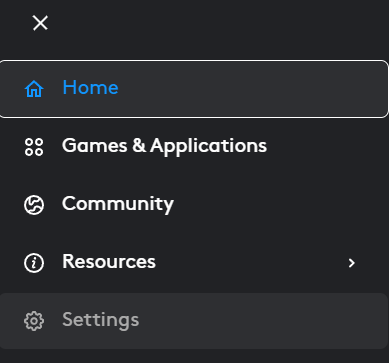
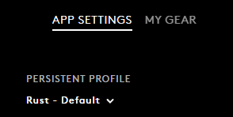
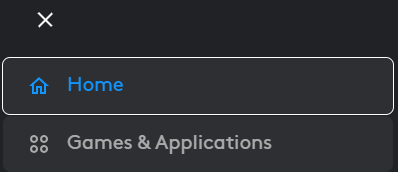
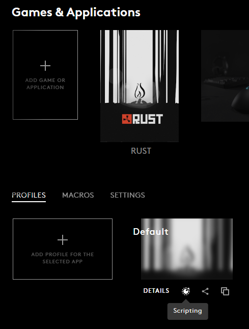
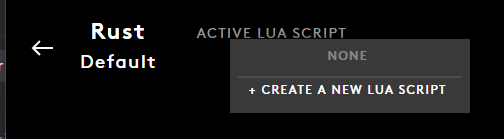
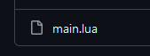
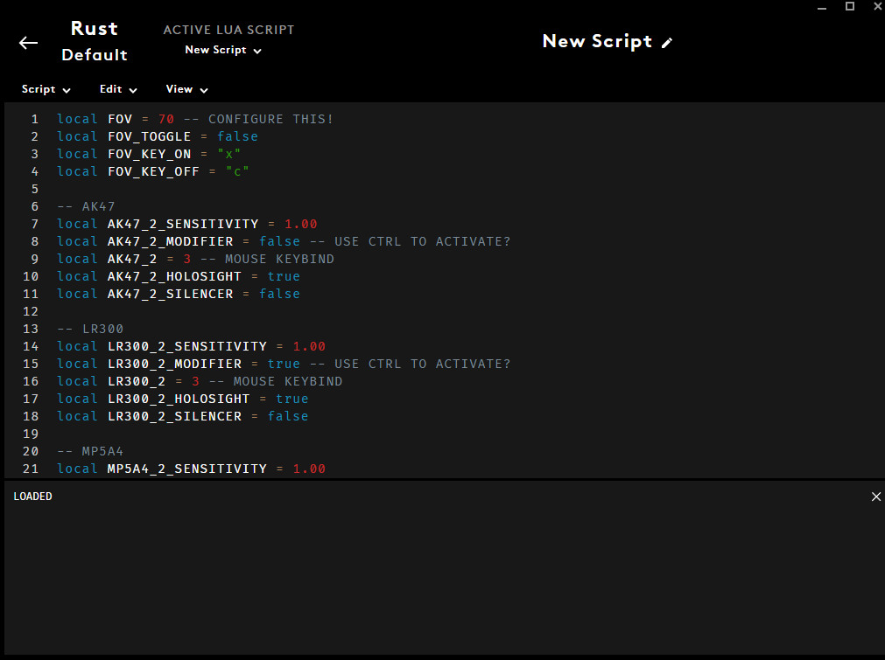
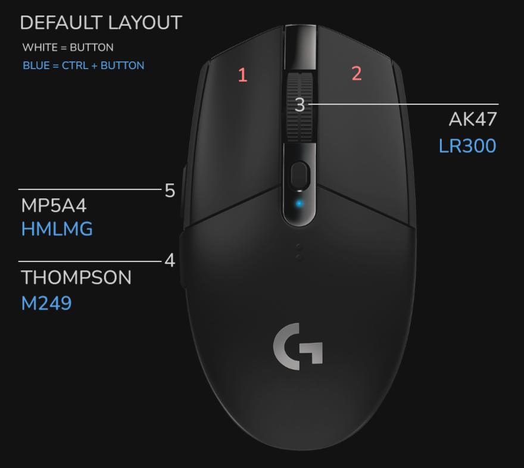
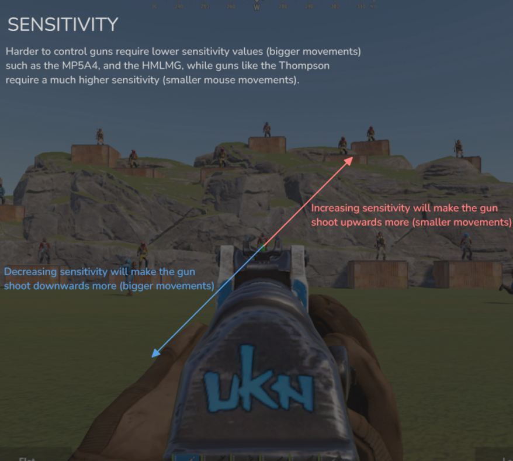

# Setting it up
## Logitech G Hub
Install the latest version of the Logitech G Hub from [Here](https://www.logitechg.com/en-us/innovation/g-hub.html).
### Setting up profiles
1. Head to the menu on the top left.


2. Go to settings



3. Set a persistent profile



4. Go back to the same menu, look for Games & Applications.



5. Look for the same rust profile that was made persistent. Click on Scripting.



6. Create a new script, Select everything in the text box, and delete it.



7. Copy the script from this repository. By clicking on the `main.lua` file, then clicking on `raw`




8. Name and save the script using `Ctrl + S` or click on `script` on the top left, `save and run`. It should say `LOADED` once saved.



## Mouse button Keybinds
Enabling different macros is bound to specific mouse buttons, they can be bound to keyboard keys
but this is highly problematic so it is not implemented.
### Default Keybinds
Each mouse button is enumerated, 1 through 5. **refer to this image for setting different keybinds:**


### Changing Keybinds
Set the keybinds by going to each respective gun, here's an example using the ak47.
```lua
-- AK47
local AK47_2_SENSITIVITY = 1.43
local AK47_2_MODIFIER = false -- <-- SET TO TRUE IF YOU WANT TO USE CTRL
local AK47_2 = 3 -- <-- CHANGE THIS
local AK47_2_HOLOSIGHT = true
local AK47_2_SILENCER = false
```
## FOV Settings
Get your ingame FOV settings by pressing `F1` and entering `graphics.fov`.
```
> graphics.fov
graphics.fov: "70"
```
Set your FOV in the **Logitech G Hub** application by changing:
```lua
local FOV = 70
```
### Switching FOV on the fly
To switch FOV while aiming down sights enable `FOV_TOGGLE`, bind one keyboard key to increase fov, and one to decrease fov. This can be accomplied by pressing `F1`, and entering for example:

`bind x graphics.fov 70`, and `bind c graphics.fov 90`. Then set the in the script the following variables:
```lua
local FOV_TOGGLE = true -- <-- SET TO TRUE
local FOV_KEY_ON = "x"  -- (SET WITH ' bind x graphics.fov 70 ')
local FOV_KEY_OFF = "c" -- (SET WITH ' bind c graphics.fov 90 ')
```

## Adjusting sensitivity
The sensitivity for every gun can be adjusted independently, increasing the sensitivity reduces recoil control, decreasing sensitivity increases recoil control.

Note that modifiers such as attachments, holosights, etc, will require a different sensitivity.



Adjust sensitivity by going to each respective gun and modifying:
```lua
local AK47_2_SENSITIVITY = 1.43 -- <-- CHANGE THIS
```
A good starting point is to set the sensitivity to your ingame sensitivity,
which you can check by pressing `F1` and checking with `input.sensitivity`.
```
> input.sensitivity
input.sensitivity: "1"
```
Make sure that the attachments are set correctly for each gun!
```lua
local AK47_2_HOLOSIGHT = true
local AK47_2_SILENCER = false
```